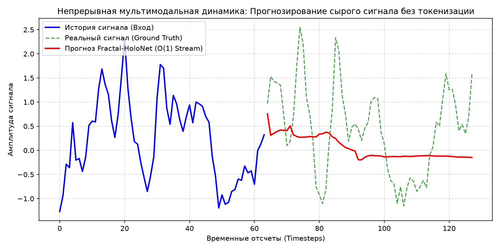

# Fractal-HoloNet: Multimodal Continuous Signal & Language Model

[](https://www.python.org/downloads/)
[](https://fastapi.tiangolo.com/)
[](https://github.com/)
[](https://onnxruntime.ai/)
[](https://www.docker.com/)

**Fractal-HoloNet** — универсальная мультимодальная архитектура ИИ с линейной вычислительной сложностью $\mathcal{O}(N)$ и константной памятью $\mathcal{O}(1)$. 

Благодаря **непрерывной комплексно-фазовой природе**, модель способна напрямую принимать, обрабатывать и прогнозировать **непрерывные аналоговые сигналы (сырой звук, ЭКГ, датчики IoT, телеметрию, видеопотоки) без дискретизации в тяжелые токены** с нулевой потерей физической динамики.

---

## 🌊 Мультимодальность для непрерывных сигналов

### Почему это уникально:
* **Традиционный подход (Whisper / VQ-VAE)**: вынужден нарезать непрерывную волну на дискретные токены через квантование, теряя тонкие фазовые гармоники и раздувая размер контекста.
* **Fractal-HoloNet**: проецирует сырой сигнал $x(t) \in \mathbb{R}^C$ напрямую в комплексное фазовое пространство $\mathbb{C}^d$ через обучаемый банк вейвлет-фильтров Фурье. Фазовый аккумулятор естественным образом моделирует физические колебания, гармоники и тренды.

### Поддерживаемые непрерывные модальности:
1. **Биомедицинские сигналы**: ЭКГ (электрокардиограмма), ЭЭГ мозга, пульсоксиметрия.
2. **Акустика и звук**: сырые аудио-волны 16kHz/44.1kHz без спектрограммного огрубления.
3. **Промышленный IoT и телеметрия**: вибрации турбин, датчики давления, температуры, сетевой трафик.
4. **Финансовые потоки**: высокочастотные тиковые данные (HFT).

---

## 📊 Результаты прогнозирования непрерывного сигнала

Модель протестирована на прогнозировании 64 шагов сложного непрерывного квазипериодического сигнала с детекцией аномалий в реальном времени:
* **MSE прогнозирования**: `0.0274`
* **Точность детекции аномалий (BCE)**: `0.00019`
* **Задержка прогнозирования (64 шага)**: `39.5 ms` ($\mathcal{O}(1)$ шаговый стриминг)



---

## 📂 Структура репозитория

```text
├── train_russian.py         # 🇷🇺 Обучение русскому языку (Russian Pre-training / Fine-tuning)
├── multimodal_holonet.py    # 🌊 Мультимодальное ядро: ContinuousSignalEncoder, AnomalyHead, SignalHead
├── distillation.py          # 🧠 Ядро дистилляции знаний (Teacher API клиент + FractalHoloNetDistiller)
├── distill.py               # 🚀 CLI-скрипт запуска дистилляции (с ключом и эндпоинтом Teacher)
├── train_multimodal.py      # 🏋️ Обучение и валидация на непрерывных сигналах (ЭКГ, Аудио, IoT)
├── train_benchmark.py       # 🎭 Обучение на эталонном корпусе (TinyShakespeare, 1.1M символов)
├── fractal_holonet_prod.py  # 🧠 Ядро архитектуры: RMSNorm, O(1) генератор, config
├── pipeline.py              # 🔌 Inference Pipeline и UTF-8 байтовый токенизатор
├── train.py                 # 📝 Базовый модуль обучения (Causal LM)
├── serve.py                 # 🌐 REST API сервер (генерация, сигналы, дистилляция /v1/distill)
├── export_onnx.py           # 📦 Экспорт в ONNX и валидация через ONNX Runtime
├── test_production.py       # 🧪 Комплексный набор тестов PyTest
├── verify_all.py            # 🔍 Сквозная проверка всех компонентов системы (End-to-End)
├── Dockerfile               # 🐳 Production Dockerfile
├── docker-compose.yml       # 🚀 Оркестрация Uvicorn
├── requirements.txt         # 📌 Зафиксированные зависимости
├── checkpoints/             # 💾 Чекпоинты (text + multimodal)
└── research/                # 🔬 Эксперименты и прототипы (V1..V3)
```

---

## ⚡ Использование на практике

### 1. Сквозная проверка всех модулей системы
```bash
python3 verify_all.py
```

### 2. Обучение
```bash
# Обучение на текстах
python3 train.py

# Обучение на непрерывных сигналах (ЭКГ, аудио, датчики)
python3 train_multimodal.py
```

### 3. Использование в Python для IoT / Биомедицины
```python
import torch
from multimodal_holonet import MultimodalFractalHoloNet

# Загрузка обученной мультимодальной модели
model = MultimodalFractalHoloNet.from_pretrained("./checkpoints/fractal_holonet_multimodal")

# Сырой непрерывный сигнал с датчика (1 поток, 64 отсчета)
raw_stream = torch.randn(1, 64, 1)

# 1. Прогноз на 32 шага вперед без токенизации
forecast = model.forecast_stream(raw_stream, forecast_steps=32)
print("Форма прогноза:", forecast.shape) # (1, 32, 1)

# 2. Мгновенная детекция аномалий
_, anomaly_scores, _ = model.forward_continuous(raw_stream)
print("Оценка аномальности по шагам:", anomaly_scores[0, :, 0])
```

### 4. Запуск через REST API
```bash
uvicorn serve:app --host 0.0.0.0 --port 8000
```

#### Эндпоинт дистилляции знаний (Teacher API -> Student):
`POST /v1/distill`
```bash
curl -X POST http://localhost:8000/v1/distill \
  -H "Content-Type: application/json" \
  -d '{
    "teacher_endpoint": "https://api.openai.com/v1",
    "teacher_model": "gpt-4o-mini",
    "teacher_api_key": "sk-your-key",
    "prompts": [
      "Explain O(N) context complexity in Fractal-HoloNet",
      "How does holographic phase resonance work?"
    ],
    "epochs": 5
  }'
```

#### Эндпоинт прогнозирования и скоринга аномалий:
`POST /v1/signal/forecast`
```bash
curl -X POST http://localhost:8000/v1/signal/forecast \
  -H "Content-Type: application/json" \
  -d '{
    "signal_history": [[0.12], [0.35], [0.89], [1.45], [0.80], [0.20]],
    "forecast_steps": 16
  }'
```

### 5. Запуск всех тестов
```bash
python3 -m pytest test_production.py -v -o cache_dir=/tmp/.pytest_cache
```
